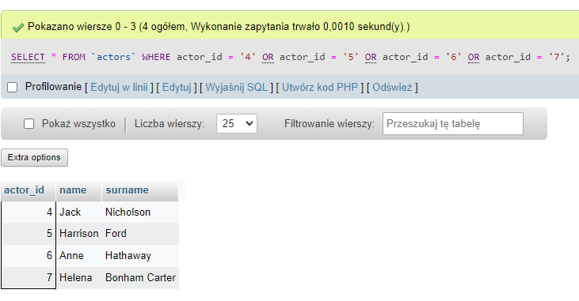
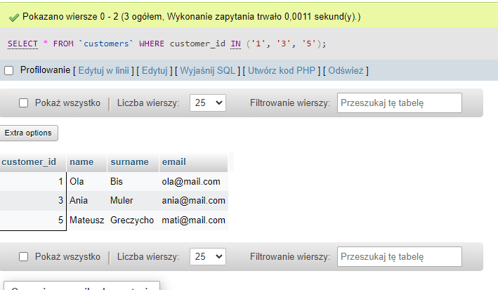
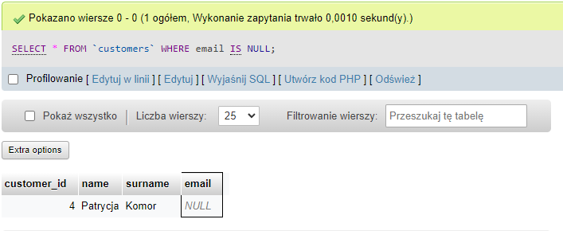
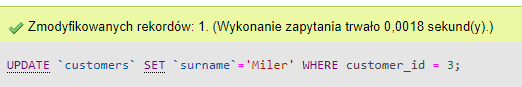
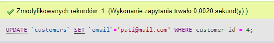
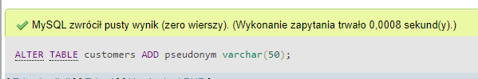

<!-- PROJECT LOGO -->

 

   
  

<h3 align="center">project_name: Software Tester in training :muscle:</h3>

  

<h3>Connect with me:</h3>

                                                                     
  
  
  
                                                                           

## TASK 1

  
  
Click here to find out how I coped with the tasks! :grin:  
    
    Table of contents:
    Subtask 1 - my test result
    Subtask 2 - the author of the task did not foresee  
    Subtask 3 - short info about me
    Subtask 4 - answers for questions about appliation
   

### Subtask 1

10/10. yeah!

### Subtask 3

Hi, my name is Ania... :point_right: Click here and read more! :blush:
 
  
I decided to take part in the project because<b> I love new challenges</b> and I would like to finally do what I like. Since the beginning of my career, I've been drawn towards "tinkering" with websites, testing mobile applications and various software, which I kind of managed to do in my previous positions, although they weren't IT-related. And I always wanted to do more of this, but the other responsibilities of my position didn't allow me to. My aim is to build up a portfolio so that I can confidently start applying for jobs in this profession.
:muscle:

### Subtask 4

  
 Click here to find out what I think of the app after seeing it for the first time :innocent:
 
 
  

    
<b>What is this application about? What is it used for?</b>  Click for answer!	:point_left:
   
    
The app is used to record matches between teams and their results.

    
    

 

<b>What functionalities are included in the application?</b>  Click for answer!	:point_left: 

   
<ol>
  <li>login,</li>
  <li>adding players, </li>
  <li>adding matches and their results, </li>
  <li>creating reports, </li>
  <li>summary panel of the number of players, matches, reports and actions entered, </li>
  <li>contact with the dev team, </li>
  <li>recent activity.</li>
  </ol>
 

  
<b>Evaluate the application interface (appearance) - do you like it or not?</b>  Click for answer!	:point_left:
 
  
<ul>
<li>The app's interface gives the impression of being very chaotic. At first it is not clear where to look, where to start and what the application is actually for. I suggest tidying up the home page and adopting standard practices in the visual and information hierarchy.</li> 
  
<li>What I find missing from the menu is what is in the middle of the panel, i.e. links to add players, contact dev team, reports. I suggest expanding the menu to include the features the site has.</li> 
  
<li>The logo and description of the application are in a non-standard place, i.e. not on the top left, but next to the menu, almost in the middle of the page, which adds to the impression of chaos. I suggest moving it to the indicated location.</li> 
  
<li>The application is so simple and has so few functions that learning how it works is a matter of a few minutes for a person with no disabilities. If you have a visual impairment, for example, it can be cumbersome. I suggest tidying up the home page and adding a guide.</li> 
  
<li>No option to add a match without adding a new player.</li> 
  
<li>There is no option to verify that the data entered is correct, i.e. that the infomation is true.</li> 

<li>The option to change the language is in a non-standard place. I suggest changing it to the right hand corner.</li> 
  
<li>On the homepage I would add information about which teams played against each other and the result of the match.</li>  
  
<li>In addition to this, I would add a section showing which team has won the most matches, which player has scored the most goals.</li>  
  
<li>It might be tempting to add photographs of the players and to add information on what minute a goal was scored and by whom.</li>  
  
<li>The panel with the number of players etc. could be clickable and redirect to a page with detailed information.</li> 
  </ul>
   
  

  

  
<b>Is the application intuitive? </b>  Click for answer!	:point_left:
 
  
  
I had to think for a while before I understood what the app was for. In my opinion, it is not intuitive, or at least there is a lot of room for improvement, as I have pointed out above.

   
  

  
  

  
<b>Do you notice any mistakes?</b>  Click for answer!!	:point_left:
 
  
  
Yes, I do :face_with_spiral_eyes: 

  <ul>
    <li>English names appear in the Polish version.</li> 
    <li>In the player's edition the level of play, Main position and alternate position should be a list of choices. At present, anything can be entered, which makes for nonsense in the reports.</li> 
    <li>In my opinion it is a mistake not to be able to add a match without adding a player.</li>  
    <li>In the report, the teams are Objects, and they should have their own names. Without that the report is worthless.</li> 
    <li>There are several errors in the console including 404. I have included a picture. <a href="https://user-images.githubusercontent.com/122752057/213030604-b4c220bc-d710-452b-9e7e-7f459aebc489.png">Click!</a></li>
    </ul>
   

  
(<a href="#readme-top">back to top</a>)

   
 
   

## TASK 2

   
Click here to see my answers! :eyes:  
    
    Table of contents:
    Subtask 1 - Writing test cases based on a User Story
    Subtask 2 - Writing test cases based on "own" experience 
    Subtask 3 - Why do we write test cases? My answers
    Subtask 4 - Extra task
   

### Subtask 1

Writing test cases based on a User Story.:point_right: Click here to see the task!
 

<ul>
<li><a href="https://docs.google.com/spreadsheets/d/1aTt7CGMSsCOjO0XpuH0wJ8-IDmtDinbDZbdOAraHMDg/edit#gid=0">link to Google sheet</a></li> 
</ul>

### Subtask 2

Writing test cases based on "own" experience. :point_right: Click here to see the task!
 

<ul>
<li><a href="https://docs.google.com/spreadsheets/d/1fUqtssrOBBiQ_dcsBuanaull8sbovIpBSK_m6hO0Bos/edit#gid=0">link to Google sheet</a></li>
  </ul>
  

 
  
### Subtask 3

Why do we write test cases? :point_right: Click here to see my answer!
 

https://user-images.githubusercontent.com/122752057/214440649-a05ec41c-1b17-4c2e-85b2-f4c1cee6fd0c.mp4

### Subtask 4

:zipper_mouth_face:
  
(<a href="#readme-top">back to top</a>)

 

## TASK 3

  
Click here to see my answers! :relaxed:  
    
    Table of contents:
    Subtask 1 - Creation of a form for reporting system errors
    Subtask 2 - Testing according to test plans and error reporting
    Subtask 3 - Test report
    Subtask 4 - Extra task
   
 
  
### Subtask 1 & Subtask 2
Creation of a form for reporting system errors & Testing according to test plans and error reporting 
<a href="https://docs.google.com/spreadsheets/d/1ps890syRlzcKgPk8r6Q5WadZ_KkOj7CZ/edit?usp=drive_link&ouid=107164675351220975541&rtpof=true&sd=true">link to Google sheet</a>

### Subtask 3
 
<a href="https://docs.google.com/presentation/d/1D0NU-WkJbHL8yWAuwewOI8xpXMr61IO7/edit?usp=drive_link&ouid=107164675351220975541&rtpof=true&sd=true">Test report</a>

## TASK 4

  
Click here to see my answers! :partying_face:  
    
    Table of contents:
    Subtask 1 - Creation of a form for reporting system bugs
    Subtask 2 - Exploratory testing and bug reporting
    Subtask 3 - My answers fr questions about the app
    Subtask 4 - Extra task
   
 
  
### Subtask 1
Creation of a form for reporting system bugs
<a href="https://docs.google.com/spreadsheets/d/1oGEi4RyQhVulM9tapa3fn3SvTDue_5RR8kdUTDxT9Dc/edit#gid=632760265">Click here!</a>

### Subtask 2
Exploratory testing and bug reporting
<a href="https://docs.google.com/spreadsheets/d/1oGEi4RyQhVulM9tapa3fn3SvTDue_5RR8kdUTDxT9Dc/edit#gid=632760265">Click here!</a>

### Subtask 3
  

    
Click here to see my answers!
 

  
<b>What is this application for? What is the purpose of this app?</b>

The app is used to sell and buy things, as well as to rent, sell property and search for jobs.

  
<b>Who is to be the end user of the app?</b>

Buyers, sellers of goods, employers and jobseekers as well as landlords and property sellers/buyers.

  
<b>Do you think the app is user friendly? </b>

Yes, I think it's user friendly.

  
<b>How would you improve the app?</b> 

I would give the search box in the search section more in the middle of the screen, as I have looked for this box many times.

  
<b>What differences do you see between testing a web app and a native app?</b>

My impression is that it is quicker to test in the app. However, in the desktop version it is quicker to log in.

  

### Subtask 4
I wanted to, but I didn't make it

(<a href="#readme-top">back to top</a>)

  
 
  
## TASK 5

Click here to see my answers! :nerd_face:  
    
    Table of contents:
    Subtask 1 - Short course on SQL basics
    Subtask 2 - Setting up the environment and uploading the database
    Subtask 3 - A couple of warm-up tasks
  
   
 
   
### Subtask 1 

 Click here. You won't regret it! :wink:

<h4>Short course on SQL basics. In github, list the operators/queries you have learned.</h4> 

<ul>
<li><b>SELECT</b> - extracts data from a database</li>
<li><b>UPDATE</b> - updates data in a database</li>
<li><b>DELETE</b> - deletes data from a database</li>
<li><b>INSERT INTO</b> - inserts new data into a database</li>
<li><b>CREATE DATABASE</b> - creates a new database</li>
<li><b>ALTER DATABASE</b> - modifies a database</li>
<li><b>CREATE TABLE</b> - creates a new table</li>
<li><b>ALTER TABLE</b> - modifies a table</li>
<li><b>DROP TABLE</b> - deletes a table</li>
<li><b>CREATE INDEX</b> - creates an index (search key)</li>
<li><b>DROP INDEX</b> - deletes an index</li>
</ul>

### Subtask 2 
                                       

 
 Click here!

<h4>Setting up the environment and uploading the database</h4>

   

                                       

                                       
### Subtask 3 

 Click here!

                                       <h4>A couple of warm-up tasks.</h4>
        

1. Display a table of actors in alphabetical order sorting by surname column.

   

                                       

2. Display the film that was made in 2019.

   

3. Display all films that were made between 1900 and 1999.

   

4. Display ONLY the title and price of films that cost less than $7.

   

5. Use the logical operator AND to display actors with actor_id between 4-7 (4 and 7 should display). DO NOT use the BETWEEN operator.

   

6. Display clients with id 2,4,6 use the logical condition for this.

   

7. Display clients with id 1,3,5 use the IN operator for this.

   

8. Display the data of all people in the table 'actors' whose first name starts with the string 'An'.

   

9. Display the data of a customer who does not have an email address specified.

   

10. Display all movies whose price is above $9 and whose ID is between 2 and 8 movie_id.     

   

                                     
                                       

(<a href="#readme-top">back to top</a>)

 

                                       
## TASK 6

Click here to see my answers! :face_exhaling:  
    
    Table of contents:
    Subtask 1 - Short course on SQL basics
    Subtask 2 - Test
    Subtask 3 - Building a portfolio
  
   
 
   
### Subtask 1 - Short course on SQL basics
                                       

 Click here!

       

11. I made a mistake in typing Annie Miler's name - I typed Muler. Find and apply a function to correct my breakneck error 🙈

   

12. I charged too much money from a customer who had bought a film with id 4. Use JOIN to check the customer's name & email.

   

                                                             

13. You have surely noticed that the salesman forgot to enter the email of Pati. Fill in this blank by typing in: pati@mail.com.

   

                                                             

14. For each purchase, display the name of the customer who made the rental and the title of the film rented. (Use the inner join function)

   

                                                             

15. Add a column 'pseudonym' to the customer table.  Add there first 2 letters of the first name and the last letter of the last name.

   

  

   

                                                             

16. Display the titles of the films that have been purchased, display the table so that the titles are not repeated.

   

                                                             

17. Display a common list of names of all actors and clients, and put the result in alphabetical order. (Use the UNION function for this)

   

                                                             

18. Raise the price of all films made after 2000 by $2.5

   

                                                             

19. Display the name of the actor with id 4 and the title of the film he played in

   

                                                             

20. Add a row to the customers table: customer_id = 7, name = Honia, surname = Stuczka-Kucharska, email = honia@mail.com, pseudonym = Hoa

   

           
                                                  
                                                             
                                                             
### Subtask 2 - Test

 My result is: 8/15

  
### Subtask 3 - Building a portfolio

[Ania's portfolio](https://github.com/annasadka/portfolio) 
                                       
                                       
                                      

